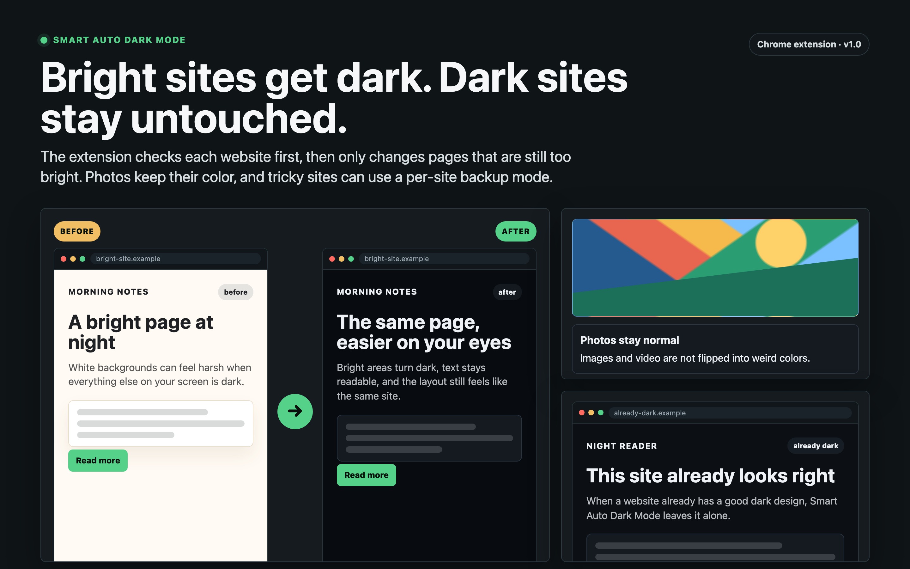
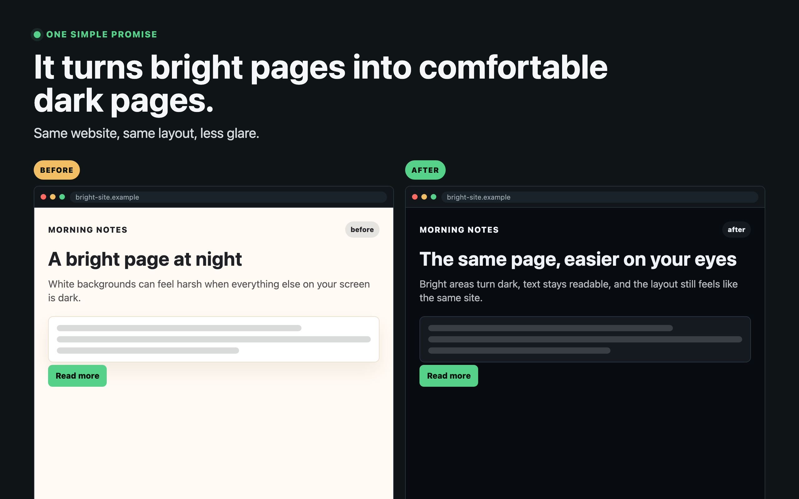
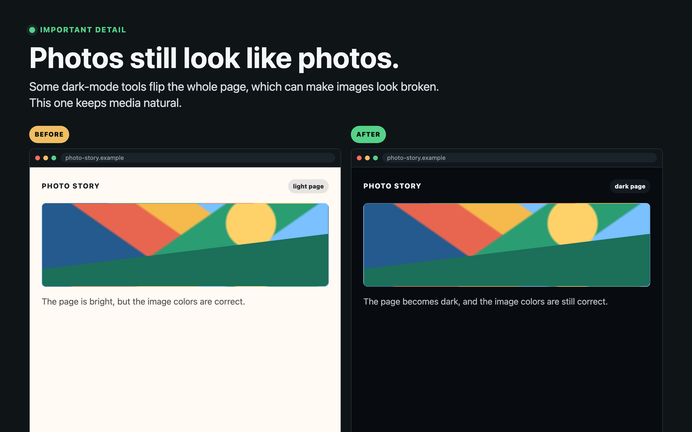
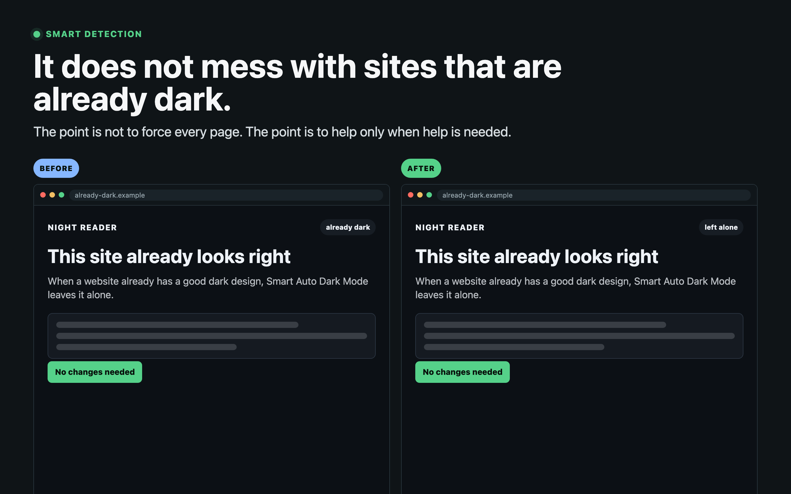
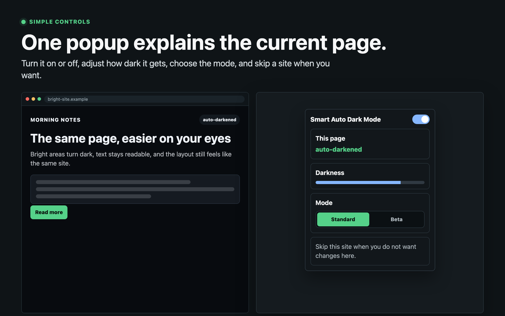

# Smart Auto Dark Mode

A Chrome extension that detects whether a site is already in dark mode, and if not, switches it with generated dark CSS instead of color inversion.

## Demos

See the full visual walkthrough on GitHub Pages: [dongt10.github.io/smart-auto-dark-mode](https://dongt10.github.io/smart-auto-dark-mode/)



| Bright pages become dark | Photos stay normal |
| --- | --- |
|  |  |

| Already-dark sites stay untouched | Simple popup controls |
| --- | --- |
|  |  |

## Features

- **Auto-detection** — samples the rendered background and text luminance of `<html>`, `<body>`, and major content roots (`main`, `article`, `#root`, etc.). Already-dark sites are left alone.
- **Site hint first, generated theme second** — sets `color-scheme: dark` on `<html>` and a `<meta name="color-scheme">` early, then applies the generated CSS theme only if the page still looks light.
- **Darkness slider (gray ↔ dark)** — tunes the generated dark palette from soft charcoal to near-black without inverting page colors.
- **Media stays natural** — images, videos, canvases, and SVGs are not inverted. Large background-image sections get a subtle dark overlay instead of a hue flip.
- **Whitelist** — per-site exclusions with subdomain matching. Adding `github.com` also covers `gist.github.com` but not `github.com.evil.com`.
- **Beta renderer for tricky sites** — per-site fallback mode can use a simpler renderer for complex apps when the standard generated theme is not the right fit.
- **Live updates** — the popup writes to `chrome.storage.local`; the content script listens for changes and refreshes the generated theme without a reload. A `MutationObserver` also handles late-loaded content.

## Install (unpacked)

1. Clone or download this repo.
2. Open `chrome://extensions`.
3. Toggle **Developer mode** on (top right).
4. Click **Load unpacked** and pick the cloned folder.
5. Pin the moon icon to your toolbar.

## Usage

Click the moon icon to open the popup:

- **Extension toggle** — global on/off.
- **This page** — pill showing the detected state (`already dark`, `light`, `true dark mode`, `whitelisted`, `extension off`).
- **Darkness slider** — drag left for a softer gray dark mode, right for pure black. Default is `100` (pure dark).
- **Renderer** — use `Standard` for generated dark CSS, or `Beta` as a per-site fallback for tricky web apps.
- **This site** — `Disable on this site` adds the current host to the whitelist. Toggles to `Re-enable on this site` once whitelisted.
- **Whitelist** — list of all whitelisted hosts; `×` to remove an entry.

The bottom row shows the live luminance values the detector measured (`bg lum`, `text lum`) — useful for tuning if you find a site where detection misfires.

## How it works

```
document_start
  ├─ load prefs from chrome.storage.local
  ├─ if active: hint <html style="color-scheme: dark">
  │             + <meta name="color-scheme" content="dark light">
  └─ schedule evaluations at 50/250/800/2000/4000 ms
              + on DOMContentLoaded + load
              + on MutationObserver (class / data-theme / style)

evaluate()
  ├─ if disabled or whitelisted → remove generated theme + clear hints
  ├─ detect: sample bg luminance from <html>, <body>, content roots
  │          + text luminance from <body>
  ├─ classify: bgLum < 0.32 AND textLum > 0.55 → "already dark"
  └─ if already dark: skip
     else:            inject <style id="__auto_dark_mode_styles__">
                        dark backgrounds/text/borders/form controls
                      + tag light elements with data-adm-* attributes
                      + preserve media colors without inversion
```

The fallback does not use `filter: invert(...)`. It reads computed colors, maps light surfaces to dark equivalents, maps dark text to light readable colors, and refreshes the same data attributes when the page changes.

## Tests

The `tests/` folder has a Preview-based runner that loads synthetic light / dark / pastel / image-heavy / `prefers-color-scheme`-aware fixtures in iframes, runs detection against each, and asserts the generated theme gets darker without applying an inversion filter.
`tests/fixtures/content-script-smoke.html` is a top-level smoke fixture that loads the real content script with a stubbed `chrome` API.

To run locally:

```bash
python3 -m http.server 8765 -d /path/to/dark-mode-extension
# then open http://localhost:8765/tests/runner.html
```

## License

MIT — see [LICENSE](LICENSE).
